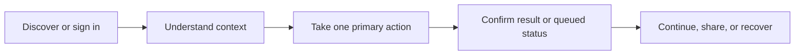

# Web and mobile end-user experience standard

## Shared visual language

Use generous spacing, readable type, strong contrast, plain-language labels, one primary action per surface, and status colors paired with text or icons. Sensitive actions use a clear confirmation step and an undo or recovery path where possible.

### Responsive public shell

```text
┌─────────────────────────────────────────────────────────────┐
│ Logo   Product / search                 Help  Sign in       │
├─────────────────────────────────────────────────────────────┤
│ Breadcrumb / context                                       │
│                                                             │
│ Page title                         [Primary action]         │
│ Short explanation / status                                  │
│ ┌──────────────┐ ┌──────────────┐ ┌──────────────┐         │
│ │ Key signal   │ │ Key signal   │ │ Key signal   │         │
│ └──────────────┘ └──────────────┘ └──────────────┘         │
│ Main content / task list                 Help / next step   │
└─────────────────────────────────────────────────────────────┘
```

On narrow screens, the header becomes a compact bar, cards stack, secondary actions move into an overflow menu, tables become readable cards, and the primary action remains reachable without horizontal scrolling.

### Mobile task shell

```text
┌──────────────────────┐
│ ←  Context       ⋯   │
│                      │
│ Title                │
│ Status / last synced │
│ ┌──────────────────┐ │
│ │ Next best action │ │
│ └──────────────────┘ │
│ Evidence / details  │
│                      │
│ ┌──────────────────┐ │
│ │ Save / Continue  │ │
│ └──────────────────┘ │
├──────────────────────┤
│ Home  Work  Alerts  Me│
└──────────────────────┘
```

Mobile is task-focused, not a shrunken admin panel: show the next action, essential context, sync freshness, and a safe way to continue after interruption.

## Journey contract



## States every interface exposes

| State | User-facing treatment |
| --- | --- |
| Loading | Show the shape of the content and what is being loaded. |
| Empty | Explain why it is empty and offer the next useful action. |
| Success | Confirm the result, timestamp, and next step. |
| Queued | Say what is processing, who owns it, and how to check progress. |
| Offline | Preserve drafts, identify unsynced work, and avoid pretending a write succeeded. |
| Conflict | Show what changed and let the user review before retrying. |
| Denied | Explain access at a safe level and provide an appropriate route to request help. |
| Failure | Use plain language, correlation/reference help, retry, and recovery guidance. |

## Accessibility and trust

Keyboard and switch users must reach every action; screen readers receive labels, roles, and live updates; focus moves to validation errors; touch targets are comfortable; dynamic text, reduced motion, RTL, locale, timezone, and currency are supported. Public pages use semantic headings, descriptive links, accessible forms, consent-aware analytics, and no sensitive data in page metadata or mobile notifications.

## Developer acceptance

An installed application is complete only when its public routes, authenticated portals, staff surfaces, and mobile screens map to the relevant module guides; authorization and policy remain server-side; API errors become human-readable states; deep links, push notifications, back navigation, rotation, refresh, retries, and interrupted workflows are tested; and analytics never substitute for visible success or failure feedback.
