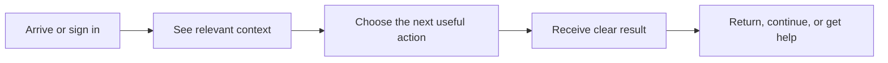

# Liberu Laravel Boilerplate — end-user guide

**Experience area:** Foundation
**Canonical developer scope:** [BOILERPLATE.md](../../../projects/boilerplate/BOILERPLATE.md)
**All module journeys:** [Module guides](modules/README.md)

## What users should feel

Sign in, account, teams, settings, notifications, and accessible navigation provide the consistent shell used by every Liberu application.

## Primary journey

## Web experience

The web surface should support discovery, deep links, keyboard access, shareable URLs where safe, responsive layouts, readable tables/cards, and clear public-to-authenticated handoff. Preserve the same terminology and status meanings across public pages, portals, and staff views.

## Mobile experience

The mobile surface should focus on the frequent task: show essential context first, keep the primary action thumb-reachable, support push/deep links only with consent, preserve drafts, show sync freshness, and recover safely from interruption or offline use. It may simplify navigation but must not weaken authorization, audit, validation, or policy.

## Visual acceptance

Use the shared [responsive shell and state contract](../../WEB-AND-MOBILE.md). A user must be able to identify where they are, what changed, what needs attention, and how to recover without reading developer documentation.

## Module map

See [all foundation module experiences](modules/README.md).
